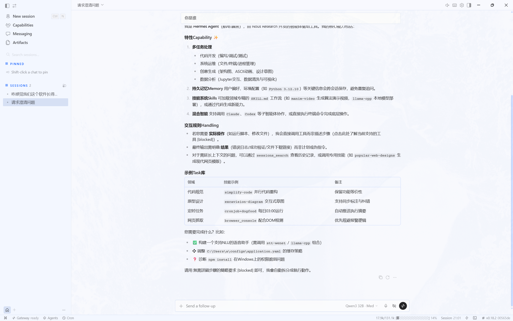
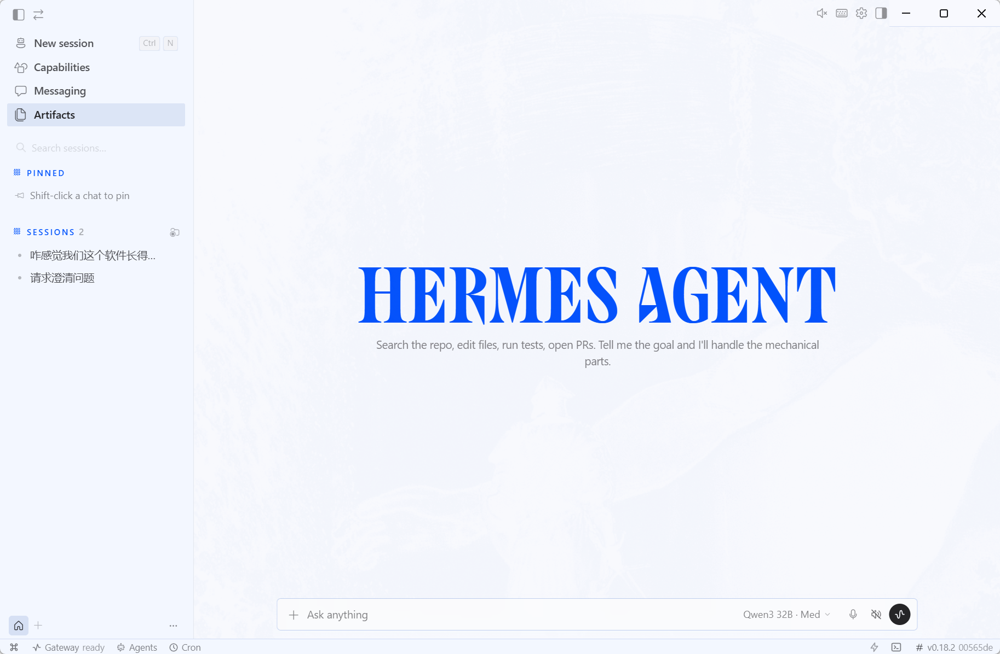
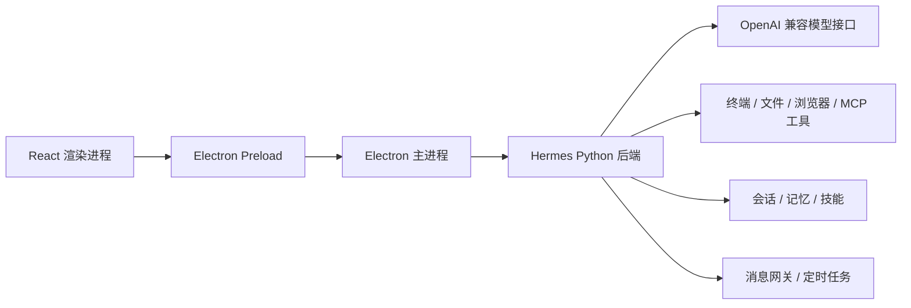

# Hermes Agent Lab

面向 Windows 课程环境整理的本地 AI 智能体桌面应用。项目基于 Nous Research 的 Hermes Agent 运行时，补充了本地 `workspace`、PowerShell 启动入口、模型供应商配置、Electron 桌面端构建流程和中文说明，便于课程演示、作业提交和后续继续开发。



## 项目简介

Hermes Agent Lab 不是单纯的聊天窗口。桌面端由 React、TypeScript、Vite 和 Electron 构成，后端复用 Python 版 Hermes Agent，可以调用终端、文件、浏览器、技能、MCP、记忆、消息网关和定时任务等能力，形成“提出目标 -> 调用工具 -> 返回证据”的智能体执行链路。

本仓库对应 GitHub 地址：

```text
https://github.com/nevernotbad/HermesAgentLab
```

## 运行效果



## 技术架构



## 主要能力

- 原生桌面体验：使用 Electron 封装 React 前端，支持 Windows 桌面应用运行。
- 统一 Agent 核心：桌面端、CLI、TUI 与网关复用同一套 Python 后端。
- 工具与技能系统：支持文件读写、命令执行、浏览器工具、MCP 工具和可扩展技能。
- 模型供应商配置：通过 `workspace/.env` 和 `workspace/config.yaml` 接入 OpenAI 兼容接口。
- 便携版构建：支持 Windows portable 单文件包，数据保存在 exe 同级 `data` 目录。
- 课程友好：提供 `run.ps1 doctor` 自检，方便在 Windows 课程机上排查环境。

## 环境要求

| 组件 | 要求 | 用途 |
| --- | --- | --- |
| Windows | Windows 10/11 | 桌面端运行与打包 |
| PowerShell | 5.1 或更高 | 执行 `run.ps1` 与安装脚本 |
| Python | `>=3.11,<3.14` | Hermes Agent 后端 |
| Node.js | `^20.19.0` 或 `>=22.12.0` | Electron 与前端构建 |
| uv | 建议安装 | Python 依赖与虚拟环境管理 |
| Git | 建议安装 | 版本管理与首次启动安装 |

## 快速开始

```powershell
git clone git@github.com:nevernotbad/HermesAgentLab.git
cd HermesAgentLab

npm ci
uv sync

.\run.ps1 doctor
npm run dev --workspace apps/desktop
```

模型密钥放在 `workspace/.env`，不要写进 `config.yaml`，也不要提交到 Git。

## 构建桌面端

```powershell
# 类型检查与生产构建
npm run build --workspace apps/desktop

# Windows 绿色便携版，输出到 apps\desktop\release
npm run desktop:package:portable:win
```

如果只是本地快速打包，也可以执行：

```powershell
npm run builder --workspace apps/desktop -- --win portable
```

正式提交或发布建议使用根目录的 `desktop:package:portable:win`，它会先检查代码、确认安装脚本来源，再构建并验收便携版。

## 目录说明

```text
HermesAgentLab/
|-- apps/desktop/       # React + Electron 桌面端
|-- agent/              # Agent 核心逻辑
|-- tools/              # 工具实现
|-- gateway/            # 消息平台与 API 网关
|-- cron/               # 定时任务
|-- skills/             # 内置技能
|-- workspace/          # 本地配置、记忆和运行状态
|-- screenplot/         # 项目截图
|-- run.ps1             # Windows 课程入口
|-- pyproject.toml      # Python 项目配置
|-- package.json        # Node.js 工作区入口
```

## 安全说明

- 不提交 `workspace/.env`、`key.txt`、token、Cookie、日志、缓存、数据库锁文件和 `node_modules`。
- 提交前使用 `git status --short` 检查暂存区，只提交源码、文档和必要配置。
- 如果密钥曾经出现在聊天、截图或公开提交中，应立即到供应商后台撤销并重新生成。

## 开源协议

项目遵循 [MIT License](LICENSE)。本仓库基于 Hermes Agent 开源项目进行课程实践整理，保留上游版权说明和原始英文文档。
