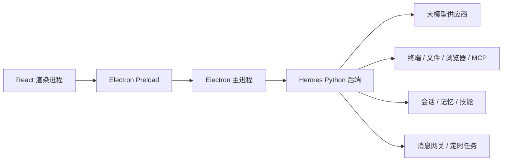

<p align="center">
  
</p>

<h1 align="center">Hermes Agent Lab</h1>

<p align="center">
  面向 Windows 的本地 AI 智能体课程实践项目<br>
  React + Electron 桌面端，Python Agent 后端，支持工具、技能、记忆、网关与定时任务
</p>

<p align="center">
  
  
  
  
  
</p>

<p align="center">
  <a href="README_en.md">English README</a> ·
  <a href="README.zh-CN.md">上游中文文档</a> ·
  <a href="https://github.com/NousResearch/hermes-agent">上游项目</a>
</p>


## 项目简介

Hermes Agent Lab 是基于 [NousResearch/hermes-agent](https://github.com/NousResearch/hermes-agent) 整理的 Windows 桌面智能体实践项目。本仓库保留 Hermes 的完整 Agent 核心，并围绕课程环境补充了便携式 PowerShell 启动入口、本地工作区、兼容模型供应商配置、Electron 桌面端构建流程和中文项目说明。

它不只是一个聊天窗口。桌面端可以调用 Python Agent 后端，由模型按需使用终端、文件、浏览器、技能、记忆、消息网关和定时任务等能力，形成“提出目标 -> 调用工具 -> 返回证据”的完整执行链路。

## 主要能力

- **原生桌面体验**：React、TypeScript、Vite 与 Electron 组成 Windows 桌面界面。
- **统一 Agent 核心**：桌面端、CLI、TUI 和消息网关复用同一套 Python Agent 能力。
- **工具与技能系统**：支持终端执行、文件处理、浏览器操作、MCP、插件和可扩展技能。
- **长期工作能力**：提供会话记录、记忆、技能沉淀、定时任务和多智能体协作机制。
- **模型供应商可切换**：支持 OpenAI 兼容接口及多种模型供应商，业务配置与代码解耦。
- **本地化运行目录**：`run.ps1` 自动将 `HERMES_HOME` 指向仓库内的 `workspace`，便于课程环境迁移与复现。

## 运行效果

下图为本机实际启动后的模型对话效果，包含 Markdown 内容、代码样式、会话管理和模型状态栏。


## 架构概览



## 环境要求

| 组件 | 要求 | 用途 |
| --- | --- | --- |
| Windows | Windows 10/11 | 桌面端运行环境 |
| PowerShell | 5.1 或更高 | 运行 `run.ps1` |
| Python | `>=3.11,<3.14` | Agent 后端 |
| Node.js | `^20.19.0` 或 `>=22.12.0` | Electron 与前端构建 |
| Git | 建议使用最新版 | 版本管理 |
| uv | 建议安装 | Python 依赖与虚拟环境管理 |

## 快速开始

### 1. 克隆项目

```powershell
git clone git@github.com:nevernotbad/HermesAgentLab.git
cd HermesAgentLab
```

### 2. 安装依赖

```powershell
uv sync
npm ci
```

所有 Node.js 工作区依赖都应在仓库根目录安装，不要在 `apps\desktop` 中单独执行 `npm install`。

### 3. 配置模型

```powershell
Copy-Item workspace\.env.example workspace\.env
```

在 `workspace\.env` 中填写自己的 API Key。`workspace\config.yaml` 保存模型名、供应商和接口地址，并通过 `${OPENAI_API_KEY}` 引用密钥，禁止把真实密钥直接写入 YAML 或提交到 Git。

### 4. 环境自检

```powershell
.\run.ps1 doctor
```

### 5. 启动桌面端

开发模式：

```powershell
npm run dev --workspace apps/desktop
```

生产构建后启动：

```powershell
npm run start --workspace apps/desktop
```

## 构建与检查

```powershell
# TypeScript 类型检查
npm run typecheck --workspace apps/desktop

# 桌面端 UI 测试
npm run test:ui --workspace apps/desktop

# 生产构建
npm run build --workspace apps/desktop

# 构建 Windows 安装包
npm run dist:win --workspace apps/desktop
```

生产构建结果位于 `apps\desktop\dist`，安装包位于 `apps\desktop\release`。这些目录属于构建产物，不提交到 Git。

## 目录说明

```text
HermesAgentLab/
|-- apps/desktop/       # React + Electron 桌面端
|-- agent/              # Agent 核心与模型适配
|-- tools/              # 工具实现与注册
|-- gateway/            # 消息平台与 API 网关
|-- cron/               # 定时任务调度
|-- skills/             # 内置技能
|-- workspace/          # 本地配置、记忆与运行状态
|-- screenplot/         # 本项目实机截图
|-- run.ps1             # Windows 便携启动入口
|-- pyproject.toml      # Python 项目与依赖配置
`-- package.json        # Node.js 工作区入口
```

## 安全说明

- `workspace/.env`、`key.txt`、日志、会话数据库、虚拟环境和 `node_modules` 均不应提交。
- README 截图不得出现 API Key、Token、Cookie 或其他账号凭据。
- 如果密钥曾出现在聊天、截图或公开提交中，应立即在供应商后台撤销并重新生成。
- 提交前建议执行 `git status --short`，确认暂存区只包含需要公开的内容。

## 上游与许可证

本项目基于 Nous Research 的 Hermes Agent 开源项目开展课程实践，保留原项目版权声明与上游文档。原始英文说明见 [README_en.md](README_en.md)，上游中文说明见 [README.zh-CN.md](README.zh-CN.md)。

项目遵循 [MIT License](LICENSE)。
